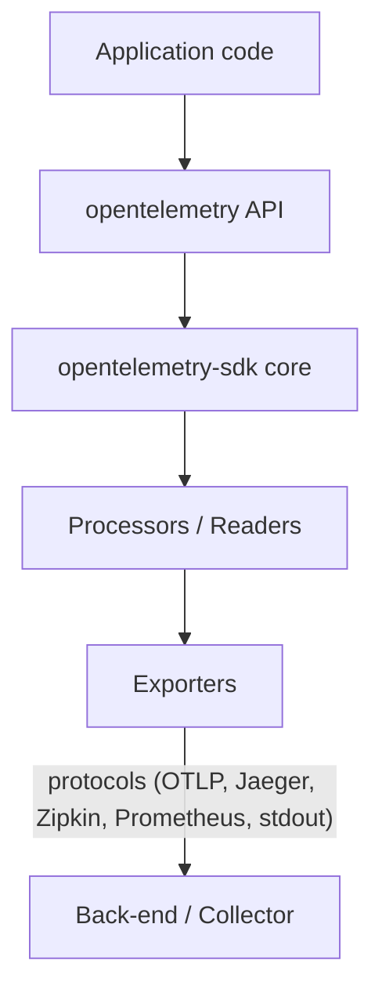

# OpenTelemetry Rust – Architecture Overview

## 1 Purpose
This document provides a stable, high-level description of how the OpenTelemetry Rust implementation is put together.  Detailed per-signal design notes live in their own files; this overview ties the pieces together.

> Reference: the [OpenTelemetry Specification](https://opentelemetry.io/docs/specs/otel/) and its [GitHub repository](https://github.com/open-telemetry/opentelemetry-specification/)

## 2 Layered Model

Key points:
1. The **API** crates are dependency-free facades that application code instruments against.
2. The **SDK** crate supplies concrete implementations, batching, aggregation, and lifecycle management.  
   • **Processors / readers** live inside the SDK and adapt buffering, temporality, and semantics.
3. **Exporters** translate OTel data into wire formats (OTLP, Prometheus, etc.) and handle transport.

## 3 Cross-cutting Components
• **Resource & Attributes** – common schema for describing process, host, and service; see the [resource spec](https://opentelemetry.io/docs/specs/otel/resource/).
• **Context & Propagation** – context management and carrier injection; see the [context propagation spec](https://opentelemetry.io/docs/specs/otel/context/).
• **Runtime model** – public APIs are runtime-agnostic; heavy I/O lives behind optional Tokio-based exporters; see the [SDK design guidelines](https://opentelemetry.io/docs/specs/otel/).
• **Error taxonomy** – SDK maps exporter/processor failures to `OTelError`; guided by the [error-handling recommendations](https://opentelemetry.io/docs/specs/otel/common/error-handling/).

## Detailed Design

### Signals

* **Traces** – [design doc](./traces.md) — trees of _spans_ capturing distributed work.
* **Metrics** – [design doc](./metrics.md) — numerical time-series data.
* **Logs** – [design doc](./logs.md) — timestamped events bridged from existing logging frameworks (`log`, `tracing`).

### Everything Else

* **OTLP** – [design doc](./otlp.md) — the OTLP exporter subsystem.

## 5 Extensibility Hooks
| Layer | Customisation points |
|-------|---------------------|
| API | Provide alternative `TracerProvider`, `MeterProvider`, `LoggerProvider` |
| SDK | Plug-in **samplers**, **metric readers**, **log processors** |
| Exporters | Support additional wire-protocols | 