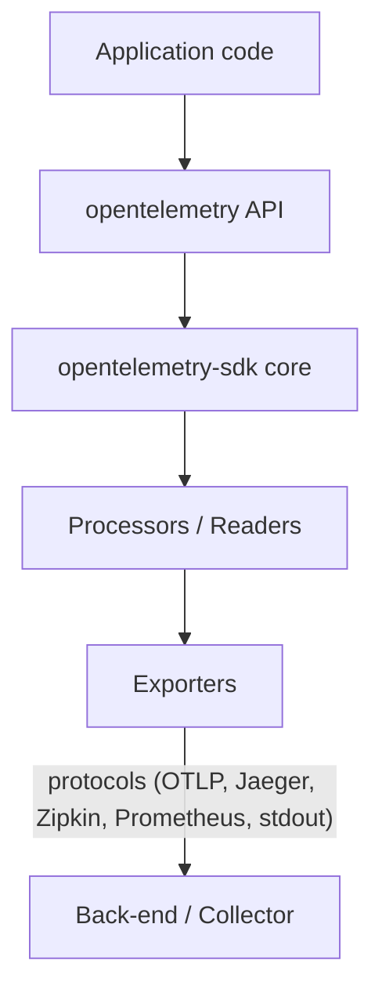

# OpenTelemetry Rust – Architecture Overview

## 1 Purpose
This document provides a stable, high-level description of how the OpenTelemetry Rust implementation is structured.  Detailed per-signal design notes live in their own files; this overview ties the pieces together.

> Reference: the [OpenTelemetry Specification](https://opentelemetry.io/docs/specs/otel/) and [repository](https://github.com/open-telemetry/opentelemetry-specification/)

## 2 Layered Model

Key points:
1. The **API** crates are dependency-free facades that applications instrument against.
2. The **SDK** crate supplies concrete implementations, batching, aggregation, and lifecycle management.
   • **Processors / readers** live inside the SDK and adapt buffering, temporality, and semantics.
3. **Exporters** translate OTel data into wire formats (OTLP, Prometheus, etc.) and handle transport.

## 3 Cross-cutting Components
• **Resource & Attributes** – common schema for describing the process, host, service, etc.  Shared by all signals. 
• **Context & Propagation** – `Context` carries span context and baggage; propagators live in `opentelemetry::propagation`. 
• **Runtime model** – most public APIs are **async-agnostic**; heavy I/O lives behind optional tokio-based exporters. 
• **Error taxonomy** – SDK wraps exporter/processor errors in `OTelError`; non-fatal failures are surfaced for back-pressure or log-only handling.

## Detailed Design

### Signals

* **Traces** – [design doc](./traces.md) — trees of _spans_ capturing distributed work.
* **Metrics** – [design doc](./metrics.md) — numerical time-series data.
* **Logs** – [design doc](./logs.md) — timestamped events likely bridged from existing logging frameworks (`log`, `tracing`).

### Everything Else

* **OTLP* - [design doc](./otlp.md) - the OTLP subsystem

## 5 Extensibility Hooks
| Layer | Customise via |
|-------|--------------|
| API   | Implement alternative `TracerProvider`, `MeterProvider`, `LoggerProvider` |
| SDK   | Pluggable **samplers**, **metric readers**, **log processors** |
| Exporters | Support different wire protocols |

