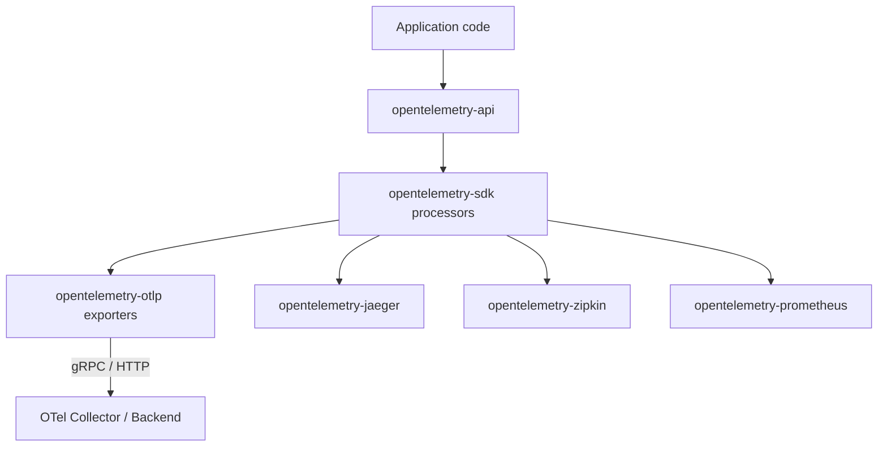
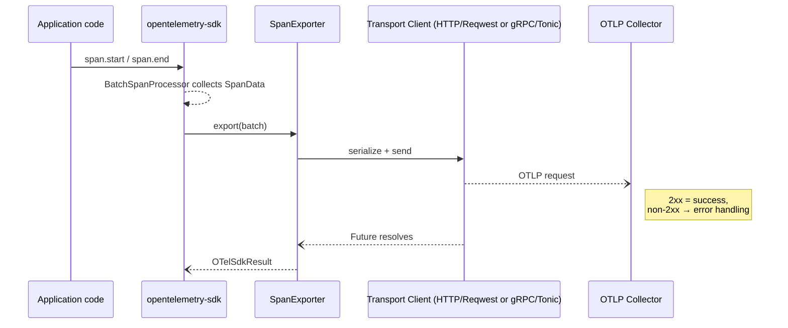

# OpenTelemetry Rust – OTLP Architecture

This document describes how the **OTLP exporters** are organised and how they integrate with the wider OpenTelemetry Rust SDK.  Review findings and compliance tracking live in `opentelemetry-otlp/arch-review.md`.

## Overview
OpenTelemetry Protocol (OTLP) is the vendor-agnostic wire format used by OpenTelemetry to transport telemetry signals (traces, metrics, logs) from instrumented code to a backend (OTel Collector or compatible vendor). It supports:

* **Encodings**  
  * *Protobuf* – canonical format  
  * *JSON* (optional)
* **Transports**  
  * *gRPC* (default port `4317`)  
  * *HTTP/1.1* (default port `4318`, binary protobuf or JSON payloads)
* **Signals**  
  * Traces, Metrics, Logs – transported independently but share common envelope (`Resource`, `Scope` etc.)

## 2. How OTLP Fits into `opentelemetry-rust`

Key points:
* `opentelemetry-sdk` owns batching, aggregation, and lifecycle; **exporters only handle serialization + transport**.
* OTLP exporters live in a separate crate to keep big deps (`tonic`, `reqwest`) optional.
* Each signal (trace/metric/log) has its own exporter type but they share common builder + transport modules.

---

## 3. Crate Layout
```text
src/
  lib.rs                 # Re-exports + feature flags + protocol enum
  span.rs | metric.rs | logs.rs   # Signal-specific builders/exporters
  exporter/
     ├── mod.rs          # Common builder traits, env var parsing, compression
     ├── http/           # Reqwest blocking/async clients, body encoder
     └── tonic/          # Tonic clients, TLS/compression helpers
```
### 3.1 Common Interfaces
* **`HasExportConfig` / `WithExportConfig`** – traits mixed into builders to expose shared config (`endpoint`, `timeout`, `protocol`).
* **Builder marker types** (`NoExporterBuilderSet`, `HttpExporterBuilderSet`, `TonicExporterBuilderSet`) enforce at compile time that exactly *one* transport is chosen.
* **`SupportedTransportClient` enum** – run-time dispatch inside the exporter when sending.

---

## 4. Feature-Flag Matrix
| Cargo feature | Purpose | Conditional modules |
|---------------|---------|---------------------|
| `trace` / `metrics` / `logs` | Enable signal exporters | `span.rs`, `metric.rs`, `logs.rs` |
| `grpc-tonic` | Use `tonic` gRPC transport | `exporter/tonic` |
| `http-proto` *(default)* | HTTP + protobuf body | `exporter/http` |
| `http-json` | HTTP + JSON body | same as above |
| `gzip-tonic` `zstd-tonic` | gRPC message compression | tonic layer |
| `reqwest-client` / `reqwest-blocking-client` *(default)* | Choose async vs blocking HTTP client |
| TLS helpers (`tls-roots`, `tls-webpki-roots`, `reqwest-rustls*`) | Supply trust roots for TLS |

Because **only one transport is valid per exporter**, `protocol` is currently a *hint* – unsupported values are ignored by the concrete builder.

---

## 5. Runtime Flow (Trace Export)

Highlights:
* Serialization happens **inside the transport client** module to keep exporters thin.
* `export` is `async` for `tonic` / `reqwest` clients, surfaced via `SpanExporter` implementing `opentelemetry_sdk::trace::SpanExporter`.
* Resource attributes are injected once per exporter via `set_resource()` before first export.

---

## 6. Configuration & Environment Variable Resolution
`exporter::mod.rs` implements helper fns:
* `default_protocol()` – chosen from compile-time defaults.
* `resolve_timeout()` – precedence: signal-specific env → generic env → builder → default 10 s.
* `parse_header_string()` – parses comma-separated `k=v` pairs with URL-decoding.

Signal builders read **signal-specific env vars** (e.g. `OTEL_EXPORTER_OTLP_TRACES_ENDPOINT`) _before_ generic ones, matching the spec.

---

## 7. Error Handling Strategy
`ExporterBuildError` is a non-exhaustive enum covering:
* Builder-time validation (URI parse, missing client)
* Feature gating errors (compression requested w/o feature)
* Runtime errors are wrapped in `OTelSdkError` from the SDK.

Design choice: **builder fails fast**, runtime exporter surfaces errors through `export()` future so processors can retry/back-off.

---

## 8. Extension & Customisation Points
1. **Custom Headers / Metadata** – builder methods `.with_metadata(map)` (gRPC) or `.with_headers()` (HTTP).
2. **Compression** – `.with_compression(Compression::Gzip)` gated by feature.
3. **TLS** – via `TonicConfig` or `HttpConfig` structs; TLS root features embed or load certs.
4. **Alternate HTTP client** – `reqwest-client` feature switches to async client; external crates could implement `OtlpHttpClient` trait in their own crate.
5. **Protocol JSON** – toggle at build time; serializers for JSON/Protobuf share same data model structs.

---

## 9. Interactions with Other Exporters
* **Prometheus exporter** (“pull” model) lives in its own crate and bypasses OTLP entirely.
* **Jaeger / Zipkin** exporters are *alternative* “push” paths; users select exactly one per signal.
* **stdout exporter** is often combined with OTLP in dev mode.
* Sample configuration:
  ```rust
  let otlp = SpanExporter::builder().with_tonic().build()?;
  let jaeger = opentelemetry_jaeger::new_agent_pipeline().install_simple()?;
  let provider = SdkTracerProvider::builder()
        .with_batch_exporter(otlp)
        .with_simple_exporter(jaeger)
        .build();
  ```

---

## 10. Key Architectural Decisions
| Decision | Rationale |
|----------|-----------|
| *Builder pattern with marker types* | Compile-time guarantee that a transport is selected exactly once. |
| *Transport-specific modules* | Keep heavy deps (`tonic`, `reqwest`) behind feature gates to minimise compile times. |
| *Env-vars override hierarchy* | Conforms to OTLP spec; simplifies Kubernetes/Docker deployments. |
| *Separate crates per exporter* | Prevent dependency bloat for projects that only need a subset of signals/transports. |
| *Non-exhaustive error enums* | Allow adding new failure modes without breaking semver. |

---

### Source References
All code links below point into the `opentelemetry-otlp` crate:

* Builder traits – [`exporter/mod.rs`](../../opentelemetry-otlp/src/exporter/mod.rs)
* HTTP transport – [`exporter/http/mod.rs`](../../opentelemetry-otlp/src/exporter/http/mod.rs)
* gRPC transport – [`exporter/tonic/mod.rs`](../../opentelemetry-otlp/src/exporter/tonic/mod.rs)
* Span exporter – [`span.rs`](../../opentelemetry-otlp/src/span.rs)
* Metric exporter – [`metric.rs`](../../opentelemetry-otlp/src/metric.rs)
* Logs exporter – [`logs.rs`](../../opentelemetry-otlp/src/logs.rs) 