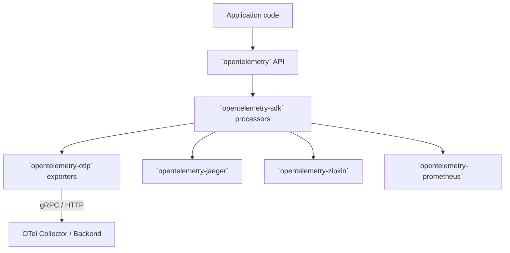
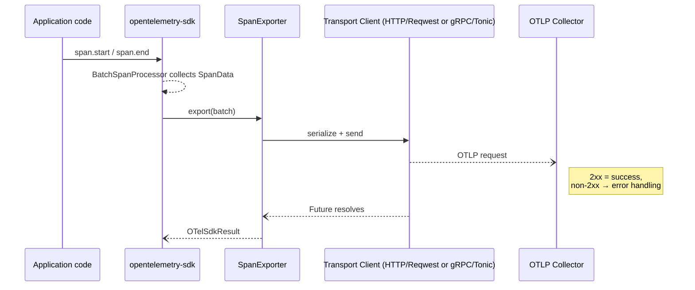

# OpenTelemetry-OTLP Architecture Review

## 1. OTLP in a Nutshell
OpenTelemetry Protocol (OTLP) is the vendor-agnostic wire format used by OpenTelemetry to transport telemetry signals (traces, metrics, logs) from instrumented code to a backend (OTel Collector or compatible vendor). It supports:

* **Encodings**  
  * *Protobuf* – canonical format  
  * *JSON* (optional)
* **Transports**  
  * *gRPC* (default port `4317`)  
  * *HTTP/1.1* (default port `4318`, binary protobuf or JSON payloads)
* **Signals**  
  * Traces, Metrics, Logs – transported independently but share common envelope (`Resource`, `Scope` etc.)

## 2. How OTLP Fits into `opentelemetry-rust`

Key points:
* `opentelemetry-sdk` owns batching, aggregation, and lifecycle; **exporters only handle serialization + transport**.
* OTLP exporters live in a **separate crate** to keep heavy deps (`tonic`, `reqwest`) optional.
* Each signal (trace/metric/log) has its own exporter type but they share common builder + transport modules.

---

## 3. Crate Layout
```text
src/
  lib.rs                 # Re-exports + feature flags + protocol enum
  span.rs | metric.rs | logs.rs   # Signal-specific builders/exporters
  exporter/
     ├── mod.rs          # Common builder traits, env var parsing, compression
     ├── http/           # Reqwest blocking/async clients, body encoder
     └── tonic/          # Tonic clients, TLS/compression helpers
```
### 3.1 Common Interfaces
* **`HasExportConfig` / `WithExportConfig`** – traits mixed into builders to expose shared config (`endpoint`, `timeout`, `protocol`).
* **Builder marker types** (`NoExporterBuilderSet`, `HttpExporterBuilderSet`, `TonicExporterBuilderSet`) enforce at compile time that exactly *one* transport is chosen.
* **`SupportedTransportClient` enum** – run-time dispatch inside the exporter when sending.

---

## 4. Feature-Flag Matrix
| Cargo feature | Purpose | Conditional modules |
|---------------|---------|---------------------|
| `trace` / `metrics` / `logs` | Enable signal exporters | `span.rs`, `metric.rs`, `logs.rs` |
| `grpc-tonic` | Use `tonic` gRPC transport | `exporter/tonic` |
| `http-proto` *(default)* | HTTP + protobuf body | `exporter/http` |
| `http-json` | HTTP + JSON body | same as above |
| `gzip-tonic` `zstd-tonic` | gRPC message compression | tonic layer |
| `reqwest-client` / `reqwest-blocking-client` *(default)* | Choose async vs blocking HTTP client |
| TLS helpers (`tls-roots`, `tls-webpki-roots`, `reqwest-rustls*`) | Supply trust roots for TLS |

Because **only one transport is valid per exporter**, `protocol` is currently a *hint* – unsupported values are ignored by the concrete builder.

---

## 5. Runtime Flow (Trace Export)

Highlights:
* Serialization happens **inside the transport client** module to keep exporters thin.
* `export` is `async` for `tonic` / `reqwest` clients, surfaced via `SpanExporter` implementing `opentelemetry_sdk::trace::SpanExporter`.
* Resource attributes are injected once per exporter via `set_resource()` before first export.

---

## 6. Configuration & Environment Variable Resolution
`exporter::mod.rs` implements helper fns:
* `default_protocol()` – chosen from compile-time defaults.
* `resolve_timeout()` – precedence: signal-specific env → generic env → builder → default 10 s.
* `parse_header_string()` – parses comma-separated `k=v` pairs with URL-decoding.

Signal builders read **signal-specific env vars** (e.g. `OTEL_EXPORTER_OTLP_TRACES_ENDPOINT`) _before_ generic ones, matching the spec.

---

## 7. Error Handling Strategy
`ExporterBuildError` is a non-exhaustive enum covering:
* Builder-time validation (URI parse, missing client)
* Feature gating errors (compression requested w/o feature)
* Runtime errors are wrapped in `OTelSdkError` from the SDK.

Design choice: **builder fails fast**, runtime exporter surfaces errors through `export()` future so processors can retry/back-off.

---

## 8. Extension & Customisation Points
1. **Custom Headers / Metadata** – builder methods `.with_metadata(map)` (gRPC) or `.with_headers()` (HTTP).
2. **Compression** – `.with_compression(Compression::Gzip)` gated by feature.
3. **TLS** – via `TonicConfig` or `HttpConfig` structs; TLS root features embed or load certs.
4. **Alternate HTTP client** – `reqwest-client` feature switches to async client; external crates could implement `OtlpHttpClient` trait in their own crate.
5. **Protocol JSON** – toggle at build time; serializers for JSON/Protobuf share same data model structs.

---

## 9. Interactions with Other Exporters
* **Prometheus exporter** (“pull” model) lives in its own crate and bypasses OTLP entirely.
* **Jaeger / Zipkin** exporters are *alternative* “push” paths; users select exactly one per signal.
* **stdout exporter** is often combined with OTLP in dev mode.
* Sample configuration:
  ```rust
  let otlp = SpanExporter::builder().with_tonic().build()?;
  let jaeger = opentelemetry_jaeger::new_agent_pipeline().install_simple()?;
  let provider = SdkTracerProvider::builder()
        .with_batch_exporter(otlp)
        .with_simple_exporter(jaeger)
        .build();
  ```

---

## 10. Key Architectural Decisions
| Decision | Rationale |
|----------|-----------|
| *Builder pattern with marker types* | Compile-time guarantee that a transport is selected exactly once. |
| *Transport-specific modules* | Keep heavy deps (`tonic`, `reqwest`) behind feature gates to minimise compile times. |
| *Env-vars override hierarchy* | Conforms to OTLP spec; simplifies Kubernetes/Docker deployments. |
| *Separate crates per exporter* | Prevent dependency bloat for projects that only need a subset of signals/transports. |
| *Non-exhaustive error enums* | Allow adding new failure modes without breaking semver. |

---

## 11. Observations & Potential Follow-ups (importance-ranked)

### A. Internal code-review findings

| Rank | Topic | Observation | Possible Follow-up | Importance | Code |
|-----:|-------|-------------|--------------------|------------|------|
| 1 | Concurrency limits | No bounding of in-flight HTTP requests; high-throughput apps may self-DOS. | Add semaphore/tower layer; expose `with_max_in_flight(n)`. | High | [exporter/http/mod.rs](./src/exporter/http/mod.rs) |
| 2 | Sync vs async HTTP default | Default `reqwest-blocking-client` spawns a thread per export; wasteful in async apps. | Make async client default or runtime-detect. | High | [exporter/mod.rs](./src/exporter/mod.rs) |
| 3 | Error taxonomy / partial-success surfacing | Runtime errors flattened; cannot distinguish retryable vs permanent. | Introduce `ExporterStatus` & surface `partial_success` info. | High | [exporter/mod.rs](./src/exporter/mod.rs) |
| 4 | Logs exporter lacks batching | `LogExporter` is synchronous; risks back-pressure. | Implement `BatchLogProcessor` mirroring spans. | High | [logs.rs](./src/logs.rs) |
| 5 | Protocol enum ambiguity | Passing wrong protocol is silently ignored. | Emit builder error or support dual-protocol fallback. | Medium-High | [lib.rs](./src/lib.rs) |
| 6 | Compression coverage | HTTP path lacks zstd support. | Add `zstd-http` feature. | Medium | [exporter/http/mod.rs](./src/exporter/http/mod.rs) |
| 7 | Metrics temporality API | Only cumulative documented; delta hidden. | Expose `with_temporality`; align with SDK selector. | Medium | [metric.rs](./src/metric.rs) |
| 8 | Builder / trait boilerplate | Repetitive impls across signals. | Create `derive(ExporterBuilder)` proc-macro. | Low-Medium | [span.rs](./src/span.rs) |
| 9 | Env-var parsing util duplication | Header-parsing duplicated across crates. | Move to shared util module. | Low | [exporter/mod.rs](./src/exporter/mod.rs) |
| 10 | Code size of tonic deps | `tonic` pulled even when unused due to default features. | Split sub-crate or adjust default-features. | Low | [Cargo.toml](./Cargo.toml) |
| 11 | MetricExporter deadlock ([#2802](https://github.com/open-telemetry/opentelemetry-rust/issues/2802)) | Uses `std::Mutex` across `.await`, can deadlock under load. | Swap to `tokio::Mutex` or lock-free pattern. | High | [exporter/tonic/metrics.rs](./src/exporter/tonic/metrics.rs) |
| 12 | Async interceptor support ([#2881](https://github.com/open-telemetry/opentelemetry-rust/issues/2881)) | gRPC auth requires async metadata injection; current API is sync-only. | Add `with_async_interceptor()` backed by tower layer. | Medium | [exporter/tonic/mod.rs](./src/exporter/tonic/mod.rs) |
| 13 | Telemetry-induces-telemetry loop ([#2877](https://github.com/open-telemetry/opentelemetry-rust/issues/2877)) | Exporter network calls generate spans that feed back into exporter. | Suppress internal spans or use dedicated noop provider inside exporters. | Medium | [exporter/http/](./src/exporter/http) |
| 14 | Graceful gRPC shutdown ([#2777](https://github.com/open-telemetry/opentelemetry-rust/issues/2777)) | `shutdown()` leaves tonic channels open. | Expose explicit `close()` or drop channel on shutdown. | High | [exporter/tonic/mod.rs](./src/exporter/tonic/mod.rs) |
| 15 | OTLP File Exporter missing ([#2602](https://github.com/open-telemetry/opentelemetry-rust/issues/2602)) | No implementation for JSON-lines file exporter per spec. | Introduce `FileExporter` crate / feature. | Medium | — |
| 16 | Builder side-effects ([#1592](https://github.com/open-telemetry/opentelemetry-rust/issues/1592)) | `install_batch` sets global tracer provider, hard-coded scope name. | Refactor builder API to avoid implicit globals. | Low-Medium | [span.rs](./src/span.rs) |

### B. OTLP-spec compliance review

| Rank | Spec Requirement (section) | Current Status | Action | Importance | Code | Spec |
|-----:|---------------------------|---------------|--------|------------|------|------|
| 1 | **MUST**: Exporters respect `RetryInfo` / `Retry-After` (Retry) | gRPC & HTTP ignore retry mechanisms. | Implement exponential back-off based on metadata / header. | High | [exporter/tonic/mod.rs](./src/exporter/tonic/mod.rs) / [exporter/http/mod.rs](./src/exporter/http/mod.rs) | <https://opentelemetry.io/docs/specs/otel/protocol/exporter/#retry> |
| 2 | **MUST**: Logs `SeverityNumber` 1-24 mapping | Exporter doesn’t validate; may emit invalid values. | Clamp/convert values before serialize. | High | [logs.rs](./src/logs.rs) | <https://opentelemetry.io/docs/specs/otel/logs/data-model/#field-severitynumber> |
| 3 | **MUST**: Support `ExponentialHistogram` & `Summary` datapoints | Not implemented. | Generate prost types & converters. | Medium-High | [metric.rs](./src/metric.rs) | <https://opentelemetry.io/docs/specs/otel/metrics/data-model/#exponentialhistogram> |
| 4 | **SHOULD**: Support gzip **and** zstd compression | HTTP path lacks zstd support. | Implement zstd for HTTP. | Medium | [exporter/http/mod.rs](./src/exporter/http/mod.rs) | <https://opentelemetry.io/docs/specs/otel/protocol/exporter/#compression> |
| 5 | **SHOULD**: Partial success body SHOULD be logged / propagated | HTTP discards, gRPC only logs. | Bubble up info via `ExporterStatus`. | Medium | [exporter/tonic/mod.rs](./src/exporter/tonic/mod.rs) | <https://opentelemetry.io/docs/specs/otlp/#partial-success> |
| 6 | **SHOULD**: System & Mozilla CA bundles available (TLS) | Features exist but off by default. | Document or enable one by default. | Low-Medium | [exporter/tonic/mod.rs](./src/exporter/tonic/mod.rs) | <https://opentelemetry.io/docs/specs/otel/protocol/exporter/#certificate-file> |
| 7 | *Draft*: TraceID 128-bit truncation rules | Not yet applicable. | Track spec evolution. | Low | — | — |

> Importance levels derive from the spec’s terminology (MUST > SHOULD > MAY) plus expected production impact for internal items.


## 12. Open Issues & PRs related to OTLP (snapshot: 2025-07-10)

_Last updated: 2025-07-10_

Below is a non-exhaustive list of **open** tickets in the `open-telemetry/opentelemetry-rust` repo that explicitly reference “OTLP”.  Numbers link to GitHub for full context.

### 12.1 Issues (newest → oldest)
| # | Title (abridged) | Updated | Area |
|---|------------------|---------|-------|
| [#3045](https://github.com/open-telemetry/opentelemetry-rust/issues/3045) | Simplify `opentelemetry-proto` (SDK decoupling, gRPC separation) | 2025-06-30 | Architecture |
| [#2881](https://github.com/open-telemetry/opentelemetry-rust/issues/2881) | Allow **async interceptors** for OTLP gRPC exporter | 2025-06-17 | Extensibility |
| [#2802](https://github.com/open-telemetry/opentelemetry-rust/issues/2802) | OTLP `MetricExporter` deadlock | 2025-05-19 | Metrics / runtime |
| [#1987](https://github.com/open-telemetry/opentelemetry-rust/issues/1987) | Broken-pipe errors when exporting via OTLP | 2025-03-31 | Stability |
| [#2877](https://github.com/open-telemetry/opentelemetry-rust/issues/2877) | Prevent *telemetry-induced telemetry* in OTLP exporter | 2025-03-27 | Performance |
| [#2777](https://github.com/open-telemetry/opentelemetry-rust/issues/2777) | Handle **shutdown** in OTLP/gRPC | 2025-03-11 | Lifecycle |
| [#2602](https://github.com/open-telemetry/opentelemetry-rust/issues/2602) | OTLP **File Exporter** | 2025-02-27 | Feature request |
| [#1592](https://github.com/open-telemetry/opentelemetry-rust/issues/1592) | OTLP Exporter **builder** ergonomics | 2024-12-14 | API |

### 12.2 Pull Requests (newest → oldest)
| # | Title | Updated | Purpose |
|---|-------|---------|---------|
| [PR #3046](https://github.com/open-telemetry/opentelemetry-rust/pull/3046) | SDK decoupling & gRPC separation | 2025-07-06 | Follow-up to issue #3045 |
| [PR #2812](https://github.com/open-telemetry/opentelemetry-rust/pull/2812) | Add **shutdown** for spans | 2025-07-04 | Lifecycle correctness |
| [PR #2727](https://github.com/open-telemetry/opentelemetry-rust/pull/2727) | **Add Retry** to OTLP exporter | 2025-06-25 | Spec compliance (RetryInfo) |
| [PR #3003](https://github.com/open-telemetry/opentelemetry-rust/pull/3003) | Guard against enabling multiple HTTP features | 2025-05-27 | Build-time safety |
| [PR #2465](https://github.com/open-telemetry/opentelemetry-rust/pull/2465) | Configure **TLS via env vars** | 2025-04-09 | Ease of use |
| [PR #2491](https://github.com/open-telemetry/opentelemetry-rust/pull/2491) | Fix (un)serialize edge-cases in metrics | 2025-03-17 | Data model |
| [PR #2524](https://github.com/open-telemetry/opentelemetry-rust/pull/2524) | OTLP **support matrix** doc | 2025-03-06 | Documentation |
| [PR #2758](https://github.com/open-telemetry/opentelemetry-rust/pull/2758) | Implement `FromStr`/`Display` for `Protocol` | 2025-03-06 | API polish |

